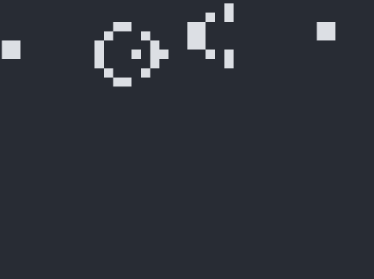

# Game of Life by Rust

Game of Life (GoL, 生命游戏) 是英国数学家 John Horton Conway 在上个世纪七十年代设计出来的一种元胞自动机 (celluar automaton)。游戏状态的演变完全由初始状态决定，不需要人工玩家的任何输入。在一定的初始配置下，游戏状态的持续演变很像微生物的活动，看起来具有一定的生命特征。

本文主要包括了生命游戏的基础知识，Rust实现的要点，以及最后的结果呈现。

## 1. 生命游戏
### 1.1 生命游戏的原理

一个 GoL 是无穷扩展的二维矩形网格，每个网格表示一个 cell，cell 有两种可能的状态 Live 和 Dead。每个 cell 有 8 个邻居 cell，位于以该 cell 为中心的九宫格在。游戏演进过程中，每个 cell 的下一个状态由自己的当前状态以及周围邻居的当前状态决定，即 GoL 的最核心的 rules。Game rules 具体为如下三条：

1. 一个 `live` cell，当其邻居中`live` cells 的数量 <2 或 >3 时，它在下一回合会变成 `dead` cell。
2. 一个 `dead` cell，当其邻居中有 3 个 `live` cells 时，它在下一回合会变成 `live` cell。
3. 所有其他情况，cell 的下一回合状态保持不变。

### 1.2 生命游戏的典型模式

上面介绍了生命游戏的原理，或者说是动力学法则。而一个具体的生命游戏的运动过程是完全由其初始 live-cells pattern 决定的，不同的 live-cells pattern 会产生不同的运动过程。在各种运动过程中，可以总结出三种典型的 (稳态) 运动模式：

- **Still life**: live-cells pattern 在游戏演进中保持静止不变
- **Oscillator**: live cells 在几种 patterns 间循环，整体位置不变
- **spaceship**: live cells 在几种 patterns 间循环，同时整体位置沿着特定方向平移

上面三种运动模式的典型例子可以看一下[维基百科](https://en.wikipedia.org/wiki/Conway%27s_Game_of_Life)。

### 1.3 具有繁殖能力的 live-cells pattern

Conway 一开始认为 live-cells pattern 要么维持上面的稳态模式，要么逐渐消亡，不可能不断繁殖出新的 cells 的。但很快 MIT 的团队发明了 "Gosper glider gun" pattern，可以源源不断生成出 glider spaceship。后来各种各样的 glider guns 被陆续发明出来。

再后来，人们发现 glider 可以和其他对象相互作用，产生不同的效果，比如可以模拟累加器以及各种逻辑门。更进一步地，各种不同的已知可编程计算机架构，都可以通过 GoL 模拟出来。

> Game of Life is theoretically as powerful as any computer with unlimited memory and no time constraints; it is Turing complete.

## 2. Rust实现要点
### 2.1 数据结构
主要定义的数据结构有：`Grid`, `GridPos`, `State`。

```rust
struct Grid {
    dim: GridPos, // field dimension: (#cells along x-dir, #cells along y-dir)
    cells: Vec<State>,
}

struct GridPos {
    x: u16,
    y: u16,
}

enum State {
    Live,
    Dead,
}
```

- `Grid` 包含了生命游戏的所有数据，`dim` 定义了模拟区域的两个方向上 `cell` 的数量，而所有 `cell`s 存储在一个 Vetor 中。
- `GridPos` 用来表示一个 `cell` 在 `Grid` 中的坐标。由于 cell 集合的存储不是以 `Vec<Vec<_>>` 格式的，我们需要为 `Grid` 定义 `GridPos` 与 Vetor index 的转换方法。
- `State` 用来表示 cell 的状态信息。

### 2.2 Game Rules

```rust
fn game_rules(state: &State, live_neibos: usize) -> State {
    match (state, live_neibos) {
        (State::Live, nb) if !(2..=3).contains(&nb) => State::Dead,
        (State::Dead, nb) if nb == 3 => State::Live,
        _ => *state,
    }
}
```

### 2.3 Count Live Neighbors

根据游戏规则，最关键的一步就是统计每个 cell 的邻居中 Live 的数量。

```rust
fn count_live_neibos(&self, idx: usize) -> usize {
    let pos = self.idx2pos(idx);
    let (x, y) = (pos.x as i32, pos.y as i32);
    vec![
        (x - 1, y - 1),
        (x, y - 1),
        (x + 1, y - 1),
        (x - 1, y),
        (x + 1, y),
        (x - 1, y + 1),
        (x, y + 1),
        (x + 1, y + 1),
    ]
    .iter()
    .filter(|(x, y)| *x >= 0 && *x < self.dim.x as i32 && *y >= 0 && *y < self.dim.y as i32)
    .map(|&(x, y)| {
        self.pos2idx(GridPos {
            x: x as u16,
            y: y as u16,
        })
    })
    .map(|i| self.cells[i])
    .filter(|s| *s == State::Live)
    .count()
}
```

### 2.4 模拟区域边界的处理

我们的模拟对象是一个无限大区域中的一块局部，那么区域边界在模拟过程中需要小心处理。我们这里采用了这样的方法：实际的模拟区域比绘图的区域大一圈，以消除模拟边界的影响。

```rust
fn render<T: Write>(&self, buffer: &mut T) -> Result<()> {
    queue!(buffer, terminal::Clear(terminal::ClearType::All))?;
    for (i, s) in self.cells.iter().enumerate() {
        let (x, y) = (i as u16 % self.dim.x, i as u16 / self.dim.x);
        // Skip border region
        if x < BOERDER || y < BOERDER || x >= self.dim.x - BOERDER || y >= self.dim.y - BOERDER
        {
            continue;
        }
        let (x, y) = (x - BOERDER, y - BOERDER);
        // draw grids inside of border
        for iy in 0..CELL_SIZE.1 {
            for ix in 0..CELL_SIZE.0 {
                queue!(
                    buffer,
                    cursor::MoveTo(x * CELL_SIZE.0 + ix, y * CELL_SIZE.1 + iy),
                    style::PrintStyledContent(match *s {
                        State::Dead => "█".black(),
                        State::Live => "█".white(),
                    })
                )?;
            }
        }
    }
    buffer.flush()?;
    Ok(())
}
```

## 3. 结果展示
### 3.1 Glider Guns

**Gosper Glider Gun**



**Simkin Glider Gun**


### 3.2 Oscillators

**Pulsar**


**Penta-decathlon**


